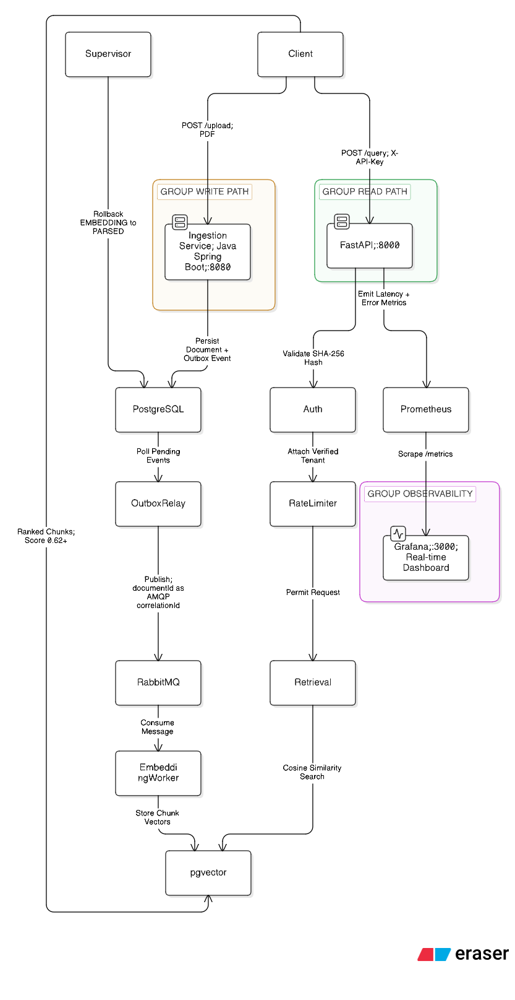
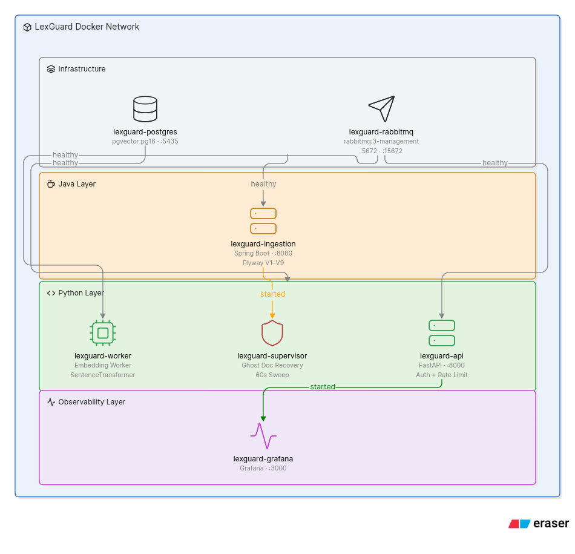

# LexGuard — Legal Inference & AI Observability Control Plane

> A secure, production-grade RAG API that lets organizations search thousands 
> of private legal documents instantly - with full observability, tenant isolation, 
> and self-healing pipeline recovery.

---
## Live Demo

```bash
curl -X POST http://your-deployment-url/demo/query \
  -H "Content-Type: application/json" \
  -d '{"query": "what are the access control requirements", "limit": 5}'
```

No API key required for the demo endpoint. Rate limited to 10 req/min per IP.

---

## Architecture




### Write Path — Async Ingestion
```
PDF Upload → Spring Boot :8080 → Cloudflare R2 + PostgreSQL Outbox 
→ RabbitMQ → Python Embedding Worker → pgvector HNSW Index
```

### Read Path — Secure RAG Retrieval
```
POST /query → SHA-256 API Key Auth → Rate Limiter (60 req/min per tenant) 
→ Input Sanitization → retrieval.py → pgvector Cosine Search → Ranked Chunks
```

### Self-Healing — Supervisor Recovery
```
Supervisor sweeps every 60s → detects stuck documents 
→ staged rollback (EMBEDDING→PARSED→UPLOADED) → requeues for processing
```

---

## Benchmarks

| Metric | Value |
|---|---|
| Chunks embedded | 148 vectors (all-MiniLM-L6-v2, 384 dimensions) |
| RAG retrieval score | 0.6233 cosine similarity |
| pgvector p99 latency (idle) | 0.18s |
| pgvector p99 latency (concurrent) | 0.48s |
| Supervisor recovery time | EMBEDDING→PARSED in <1s per document |
| Pipeline completion | version = 5 (5 atomic state transitions) |
| Supervisor rollback verified | EMBEDDING→PARSED at version = 6 |

---

## Observability Dashboard


Real-time pipeline monitoring via Prometheus + Grafana:
- pgvector p50/p95/p99 search latency histogram
- Stuck document count with 10-minute threshold
- RabbitMQ queue depth
- Supervisor sweep timestamp

---

## Key Engineering Decisions

**Transactional Outbox over direct RabbitMQ publish**
The Java service atomically writes to both `documents` and `outbox_messages` 
in a single database transaction. A scheduled relay polls with 
`FOR UPDATE SKIP LOCKED` for safe multi-pod concurrency. Guarantees 
exactly-once delivery without Kafka. Upload returns `202 Accepted` only 
after the document is durably stored.

**Per-document isolated sessions in supervisor**
Each ghost document recovery runs in its own SQLAlchemy session with 
`FOR UPDATE SKIP LOCKED`. A failure on document 50 cannot roll back 49 
successful recoveries. Staged rollback map restores the last safe checkpoint 
based on what processing was lost — not a blind retry.

**Correlation IDs across language boundaries**
`documentId` stamped as native AMQP `correlation_id` property (not JSON body) 
so the Python worker reads the trace ID before deserializing the payload. 
A poison pill message is still fully traceable. On the read path, Python 
`contextvars` threads the `X-Correlation-ID` through every log line without 
argument drilling. Zero fake trace IDs from Prometheus scrapers — `/metrics` 
bypasses the correlation middleware entirely.

**Optimistic locking via version column**
`EMBEDDING` is a distributed lock state written durably to PostgreSQL before 
the `SentenceTransformer` computation begins. If two workers race on the same 
document, the slow worker's final commit raises `StaleDataError` and safely 
aborts — no duplicate vectors in the store.

---

## Tech Stack

| Layer | Technology |
|---|---|
| Ingestion API | Java 21, Spring Boot 3.5, Flyway V1–V9 |
| Message Queue | RabbitMQ 3 (Transactional Outbox, AMQP correlation headers) |
| Embedding Worker | Python 3.12, SentenceTransformers (all-MiniLM-L6-v2) |
| Vector Database | PostgreSQL 16 + pgvector (HNSW m=16, ef=128) |
| RAG API | FastAPI, SQLAlchemy 2.0 |
| Storage | Cloudflare R2 |
| Security | SHA-256 API key auth, SlowAPI token bucket, prompt injection defense |
| Observability | Prometheus, Grafana, correlation ID tracing (contextvars + AMQP) |
| Infrastructure | Docker Compose (8 services) |

---

## Quick Start

### Prerequisites
- Docker and Docker Compose
- Cloudflare R2 bucket with API credentials

### Step 1 — Configure environment

```env
R2_ACCOUNT_ID=your_cloudflare_account_id
R2_ACCESS_KEY=your_r2_access_key
R2_SECRET_KEY=your_r2_secret_key
R2_BUCKET_NAME=your_bucket_name
```

### Step 2 — Start all services

```bash
docker compose up --build
```

This starts 8 services: `postgres`, `rabbitmq`, `ingestion-service`, 
`embedding-worker`, `supervisor`, `api`, `prometheus`, `grafana`.

Flyway migrations V1–V9 run automatically on ingestion service startup.

Wait for:
- `lexguard-ingestion` → `Started LexGuardIngestionApplication`
- `lexguard-api` → `Uvicorn running on http://0.0.0.0:8000`
- `lexguard-worker` → `Embedding Worker successfully started`

### Step 3 — Upload a document

```bash
curl -X POST http://localhost:8080/api/v1/documents \
  -H "X-Tenant-ID: tenant-001" \
  -F "file=@your_contract.pdf;type=application/pdf"
```

### Step 4 — Query (no auth required)

```bash
curl -X POST http://localhost:8000/demo/query \
  -H "Content-Type: application/json" \
  -d '{"query": "what are the access control requirements", "limit": 5}'
```

### Step 5 — Monitor

```bash
# Pipeline health
curl http://localhost:8000/health

# Grafana dashboard
open http://localhost:3000  # admin/admin

# Prometheus metrics
open http://localhost:9090
```

### Step 6 — Verify pipeline state

```bash
docker exec lexguard-postgres psql -U admin -d lexguard \
  -c "SELECT id, status, version, updated_at FROM documents ORDER BY created_at DESC LIMIT 5;"
```

A completed document shows `status = COMPLETED` and `version = 5`.

---

## API Reference

| Endpoint | Auth | Rate Limit | Description |
|---|---|---|---|
| `POST /api/v1/documents` | X-Tenant-ID header | — | Upload PDF for ingestion |
| `POST /demo/query` | None | 10 req/min per IP | Public RAG search |
| `POST /query` | X-API-Key | 60 req/min per tenant | Authenticated RAG search |
| `GET /health` | None | — | Live pipeline state |
| `GET /metrics` | None | — | Prometheus scrape endpoint |

Interactive docs: `http://localhost:8000/docs`

---

## Phase 1 — Async Ingestion Pipeline 

### Transactional Outbox Pattern

The Spring Boot service never publishes directly to RabbitMQ. Every document 
upload atomically writes to both the `documents` table and the 
`outbox_messages` table inside a single database transaction. A scheduled 
relay polls unpublished outbox rows using `FOR UPDATE SKIP LOCKED` and 
publishes them to RabbitMQ, marking each row `PUBLISHED` only after the 
broker confirms receipt via synchronous publisher confirms.

### Schema and Migrations

Flyway-managed schema with nine verified migrations (V1–V9).

`documents` — tenant-isolated metadata with a six-state PostgreSQL enum, 
`is_latest` flag for contract version routing, and `version` integer for 
optimistic locking.

`document_chunks` + `chunk_embeddings` — separated vector table with 
`(chunk_id, model_name)` unique constraint enabling zero-downtime embedding 
model upgrades. HNSW index at `m=16, ef_construction=128`.

`outbox_events` — Python-side outbox with `server_default` enforced at DDL 
layer.

`system_heartbeats` — supervisor sweep timestamp for active health monitoring.

`users` — tenant registry with SHA-256 hashed API keys, rate limit tier, 
and `is_active` kill switch.

### Python Embedding Worker

State-driven checkpoint pipeline with `prefetch_count=1` and `heartbeat=600`:

- `processor.py` — resumable pipeline distinguishing transient failures 
  (NACK with requeue) from terminal failures (mark FAILED, ACK to drain).
- `worker.py` — reads `correlation_id` from AMQP envelope before 
  deserializing payload. Poison pill messages remain traceable.
- `supervisor.py` — per-document isolated sessions, staged rollback map, 
  `FOR UPDATE SKIP LOCKED`, writes heartbeat to `system_heartbeats` after 
  every sweep cycle.

### RAG Retrieval

`retrieval.py` embeds the query with `all-MiniLM-L6-v2`, executes a 
CTE-optimised cosine similarity search, and enforces two mandatory filters: 
`status = 'COMPLETED'` and `is_latest = true`. Distance converted to 
similarity score via `1.0 - distance`.

---

## Phase 2 — Active Observability Layer 

### Distributed Tracing

- **Read path:** `X-Correlation-ID` generated in FastAPI middleware, threaded 
  through `retrieval.py` via Python `contextvars`. Zero argument drilling.
- **Write path:** `documentId` stamped as native AMQP `correlation_id` 
  property by the Java outbox relay. Python worker reads it from the envelope 
  before touching the payload.

### Prometheus Metrics

- `pgvector_search_latency_seconds` — histogram with buckets from 1ms to 1s
- `lexguard_stuck_document_count` — gauge updated on every `/health` call
- `lexguard_rabbitmq_queue_depth` — gauge updated on every `/health` call  
- `lexguard_last_supervisor_sweep_timestamp_seconds` — gauge updated on 
  every `/health` call

### Security Layer

- SHA-256 API key validation against `users` table (indexed B-tree lookup)
- SlowAPI token bucket: 60 req/min per verified tenant, 10 req/min per IP 
  for unauthenticated endpoints
- Input sanitization: length bounds, control character rejection, 
  prompt injection defense (LLM control token regex)
- Custom exception handler rewrites prompt injection `422` to `403` to 
  avoid fingerprinting

---

## Repository Structure

```
LexGuard/
├── docker-compose.yml              # 8-service compose
├── prometheus.yml                  # Prometheus scrape config
├── .env                            # R2 credentials (not committed)
├── docs/
│   ├── architecture.png            # System architecture diagram
│   └── grafana.png                 # Observability dashboard screenshot
├── ingestion-service/              # Spring Boot 3.5 / Java 21
│   ├── Dockerfile
│   └── src/main/resources/
│       └── db/migration/           # V1–V9 Flyway migrations
└── embedding-worker/               # Python 3.12
    ├── Dockerfile
    ├── main.py                     # FastAPI — auth, rate limit, /query, /health
    ├── telemetry.py                # ContextVar, logging filter, Prometheus metrics
    ├── retrieval.py                # pgvector cosine similarity search
    ├── worker.py                   # pika RabbitMQ consumer
    ├── processor.py                # Parse + embed pipeline
    ├── supervisor.py               # Ghost document recovery
    ├── models.py                   # SQLAlchemy ORM + pgvector
    └── config.py                   # Environment configuration
```

---

Built by Sonu Verma 
GitHub: [Spectraa28](https://github.com/Spectraa28)
```